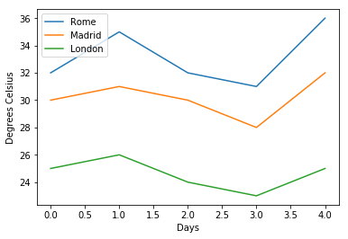
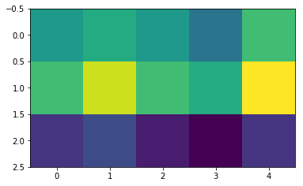
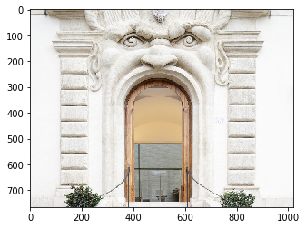
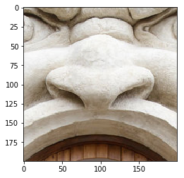

## Introduction to Visual Computing in Python


Clearly, in a brief course about computer vision for art history, a full introduction to computer science would be out of scope! 

But it's worth introducing a few pieces of practical programming language in Python to help you follow the rest of the book. We won't be covering many fundamentals of computer science (object-oriented programming, compilers, algorithm theory...) - but we will introduce the basics of scientific computing, especially involving matrices/arrays and visualisations. 

Let's start with the basics - we're going to load some [libraries](https://en.wikipedia.org/wiki/Library_(computing)). Libraries are bundles of pre-written code that do common tasks, like multiplying large arrays quickly or visualising a graph. 


<div markdown="1" class="cell code_cell">
<div class="input_area" markdown="1">
```python
# NumPy is the standard Python library for scientific computing. 
# we don't want to type numpy every time we use it, so we're going to give it an alias, 'np'
import numpy as np
# we're also going to import some sub-libraries, 'transform' (image transformation) 
# and 'io' (file reading/writing), from the library skimage 
from skimage import transform, io
# pyplot from the library matplotlib is a standard plotting library. 
# Again, to save typing 'pyplot' each time, we're going to locally refer ot it as 'plt'
from matplotlib import pyplot as plt
# This is just a macro to plot inside the browser, not in a new window:
%matplotlib inline
print('Libraries are loaded')

```
</div>

</div>


Now we've imported some essential libraries, we can start to play around with them. For instance, let's do some simple maths:


<div markdown="1" class="cell code_cell">
<div class="input_area" markdown="1">
```python
x = 5 
y = x / 2
print(y)

```
</div>

<div class="output_wrapper" markdown="1">
<div class="output_subarea" markdown="1">
{:.output_stream}
```
2.5
```
</div>
</div>
</div>


# Data Types

Normal Python is perfectly good at doing this kind of maths, but it can't handle a [matrix](https://en.wikipedia.org/wiki/Matrix_(mathematics)) very well. If you don't know what a matrix is, you might want to read the wikipedia link a little - but it's basically a 2-dimensional set of numbers, like a spreadsheet or an image. 

A note on terminology. It's easy to mix up maths terminology (scalar, vector, matrix, tensor) with programming terminology (float, list, array) - they don't precisely match up. One is about the mathematical nature of the variables (and what kinds of operations they do or don't permit), whereas the other is about how a computer *stores* these variables. To be clear...

## Maths terminology

A **scalar** is a single number, like today's temperature:

`30`

A **vector** is a one-dimensional chain of numbers, like the temperature in Madrid over the next five days

`[30, 31, 30, 28, 32]`

A **matrix** is a two-dimensional table of numbers, like the temperatures in Rome, Madrid and London over the next five days:

`[[32, 35, 32, 31, 36],
[30, 31, 30, 28, 32],
[25, 26, 24, 23, 25]]`

If a scalar is 0-dimensional, a vector is 1-dimensional and a matrix is 2-dimensional, then a **tensor** is the generic form - it could be 4-, 6-, or 1343-dimensional. Although a scalar is technically a tensor (of 'rank zero'), when we speak of tensors we normally mean at least 2-dimensional constructions. For instance, an image is a three-dimensional tensor (the x-axis, the y-axis and the colour depth). 

## Computer Science terminology

We can save a scalar as an integer:


<div markdown="1" class="cell code_cell">
<div class="input_area" markdown="1">
```python
x = 3
print(type(x))

```
</div>

<div class="output_wrapper" markdown="1">
<div class="output_subarea" markdown="1">
{:.output_stream}
```
<class 'int'>
```
</div>
</div>
</div>


Integers don't allow for decimal places, so most of the time we save things as a 'floating-point number', or float. The only disadvantage to this is that it takes up more memory. Anything with a decimal point will be made into a float:


<div markdown="1" class="cell code_cell">
<div class="input_area" markdown="1">
```python
x = 3.0
print(type(x))

```
</div>

<div class="output_wrapper" markdown="1">
<div class="output_subarea" markdown="1">
{:.output_stream}
```
<class 'float'>
```
</div>
</div>
</div>


Whether ints or floats, we can chain these up into a list:


<div markdown="1" class="cell code_cell">
<div class="input_area" markdown="1">
```python
rome_temp = [32, 35, 32, 31, 36]
print(type(rome_temp))

```
</div>

<div class="output_wrapper" markdown="1">
<div class="output_subarea" markdown="1">
{:.output_stream}
```
<class 'list'>
```
</div>
</div>
</div>


We can make lists of lists (and lists of lists of lists, and so on). This allows us to save a matrix (a 2-dimensional construct) by using lists:


<div markdown="1" class="cell code_cell">
<div class="input_area" markdown="1">
```python
madrid_temp = [30, 31, 30, 28, 32]
london_temp = [25, 26, 24, 23, 25]
all_temp = [rome_temp, madrid_temp, london_temp]
print(all_temp)
print(type(all_temp))

```
</div>

<div class="output_wrapper" markdown="1">
<div class="output_subarea" markdown="1">
{:.output_stream}
```
[[30, 31, 30, 28, 32], [32, 35, 32, 31, 36], [25, 26, 24, 23, 25]]
<class 'list'>
```
</div>
</div>
</div>


In theory, we can make any kind of vector, matrix or tensor using lists of lists of lists. However, computation using lists is very slow. So anytime we need to do some maths to a vector/matrix/tensor, we use an `array`:


<div markdown="1" class="cell code_cell">
<div class="input_area" markdown="1">
```python
temp_array = np.asarray(all_temp)
print(temp_array)

```
</div>

</div>


We can then use indexes to select particular parts of the array - useful when you want to crop an image. Note that, like in most programming languages, **we access the 'first' element with a 0**! There are good reasons for that, which you can learn about [here](https://en.wikipedia.org/wiki/Zero-based_numbering). Let's try a few examples:


<div markdown="1" class="cell code_cell">
<div class="input_area" markdown="1">
```python
# Only today's temperature in Rome
print('Rome today: ')
print(temp_array[0,0])
# Only the temperatures in London
print('London forecast: ')
print(temp_array[2,:])
# Only the temperatures today and tomorrow, in all cities:
print('Next two days over Europe: ')
print(temp_array[:,0:2])

```
</div>

<div class="output_wrapper" markdown="1">
<div class="output_subarea" markdown="1">
{:.output_stream}
```
Rome today: 
30
London forecast: 
[25 26 24 23 25]
Next two days over Europe: 
[[30 31]
 [32 35]
 [25 26]]
```
</div>
</div>
</div>


# Visualisation

Using our plotting library MatPlotLib, we can now see what these temperatures look like. Note again that our days start at *zero*, not one. 


<div markdown="1" class="cell code_cell">
<div class="input_area" markdown="1">
```python
plt.plot(rome_temp,label='Rome')
plt.plot(madrid_temp,label='Madrid')
plt.plot(london_temp,label='London')
plt.xlabel('Days')
plt.ylabel('Degrees Celsius')
plt.legend();

```
</div>

<div class="output_wrapper" markdown="1">
<div class="output_subarea" markdown="1">

{:.output_png}


</div>
</div>
</div>


## Showing Images

Using MatPlotLib, we can even plot arrays as images - this will be very useful later!

We format these images as NumPy arrays. For now, let's use the temperature array we made earlier...


<div markdown="1" class="cell code_cell">
<div class="input_area" markdown="1">
```python
plt.imshow(temp_array)

```
</div>

<div class="output_wrapper" markdown="1">
<div class="output_subarea" markdown="1">


{:.output_data_text}
```
<matplotlib.image.AxesImage at 0x7fb4b54cffd0>
```


</div>
</div>
<div class="output_wrapper" markdown="1">
<div class="output_subarea" markdown="1">

{:.output_png}


</div>
</div>
</div>


It works, but it's not that interesting. Let's use the `io` component from the `skimage` library to show a real image. It can read a local file (by giving it the location and filename), or even an image from the internet:


<div markdown="1" class="cell code_cell">
<div class="input_area" markdown="1">
```python
my_image = io.imread('https://www.biblhertz.it/2594550/original-1558360959.jpg')
plt.imshow(my_image)

```
</div>

<div class="output_wrapper" markdown="1">
<div class="output_subarea" markdown="1">


{:.output_data_text}
```
<matplotlib.image.AxesImage at 0x7fb4b4b137b8>
```


</div>
</div>
<div class="output_wrapper" markdown="1">
<div class="output_subarea" markdown="1">

{:.output_png}


</div>
</div>
</div>


In the next chapter, we'll take a closer look at how digital images are stored as arrays, which we can access just like we did before: 


<div markdown="1" class="cell code_cell">
<div class="input_area" markdown="1">
```python
plt.imshow(my_image[100:300,400:600,:])

```
</div>

<div class="output_wrapper" markdown="1">
<div class="output_subarea" markdown="1">


{:.output_data_text}
```
<matplotlib.image.AxesImage at 0x7fb4b49473c8>
```


</div>
</div>
<div class="output_wrapper" markdown="1">
<div class="output_subarea" markdown="1">

{:.output_png}


</div>
</div>
</div>


And that's it! Next chapter, Digital Images...

