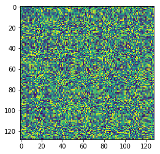
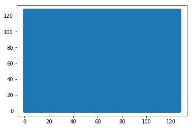
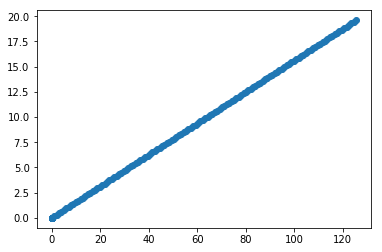
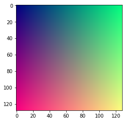
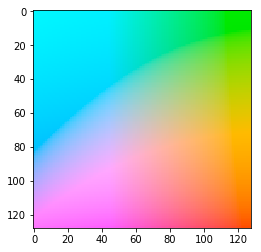
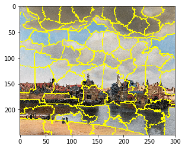

---
redirect_from:
  - "/01/pixels-and-arrays"
interact_link: content/01/pixels_and_arrays.ipynb
kernel_name: python3
has_widgets: false
title: 'Pixels and Arrays'
prev_page:
  url: /01/digital_images
  title: 'Digital Images'
next_page:
  url: /01/digital_images_ch
  title: 'Digital Images in Cultural Heritage'
comment: "***PROGRAMMATICALLY GENERATED, DO NOT EDIT. SEE ORIGINAL FILES IN /content***"
---


# Pixels and Arrays


Digital images are, obviously enough, stored as pixels. 

But just how do these pixels relate to what we see on the screen? It may seem like a banal question, but it's worth repeating some common image-processing tasks - the kind of thing you might do easily in Photoshop or GIMP - in terms of pixelwise computation and matrix algebra. 

We're going to focus on a few basic tasks: 
- rotating and warping an image
- image colour spaces
- contrast and superpixels


<div markdown="1" class="cell code_cell">
<div class="input_area" markdown="1">
```python
print('Starting, kernel ready')
import numpy as np
from matplotlib import pyplot as plt
%matplotlib inline
from skimage import io, transform, color
import urllib.request
import json 
print('Loaded libraries')

```
</div>

<div class="output_wrapper" markdown="1">
<div class="output_subarea" markdown="1">
{:.output_stream}
```
Starting, kernel ready
Loaded libraries
```
</div>
</div>
</div>


<div markdown="1" class="cell code_cell">
<div class="input_area" markdown="1">
```python
testim = io.imread('http://www.arte.it/foto/600x450/02/2670-car_09_672-458_resize.jpg')
plt.imshow(testim)

```
</div>

<div class="output_wrapper" markdown="1">
<div class="output_subarea" markdown="1">
{:.output_traceback_line}
```

    ---------------------------------------------------------------------------

    OSError                                   Traceback (most recent call last)

    <ipython-input-2-e7f2bfe4e2d4> in <module>()
    ----> 1 testim = io.imread('http://www.arte.it/foto/600x450/02/2670-car_09_672-458_resize.jpg')
          2 plt.imshow(testim)


    /anaconda3/lib/python3.7/site-packages/skimage/io/_io.py in imread(fname, as_gray, plugin, flatten, **plugin_args)
         60 
         61     with file_or_url_context(fname) as fname:
    ---> 62         img = call_plugin('imread', fname, plugin=plugin, **plugin_args)
         63 
         64     if not hasattr(img, 'ndim'):


    /anaconda3/lib/python3.7/site-packages/skimage/io/manage_plugins.py in call_plugin(kind, *args, **kwargs)
        212                                (plugin, kind))
        213 
    --> 214     return func(*args, **kwargs)
        215 
        216 


    /anaconda3/lib/python3.7/site-packages/skimage/io/_plugins/pil_plugin.py in imread(fname, dtype, img_num, **kwargs)
         34     if isinstance(fname, string_types):
         35         with open(fname, 'rb') as f:
    ---> 36             im = Image.open(f)
         37             return pil_to_ndarray(im, dtype=dtype, img_num=img_num)
         38     else:


    /anaconda3/lib/python3.7/site-packages/PIL/Image.py in open(fp, mode)
       2685         warnings.warn(message)
       2686     raise IOError("cannot identify image file %r"
    -> 2687                   % (filename if filename else fp))
       2688 
       2689 #


    OSError: cannot identify image file <_io.BufferedReader name='/var/folders/qz/qvlhd5cd2hnf392rtv298pc80000gn/T/tmp40jotg63.jpg'>


```
</div>
</div>
</div>


### Rotating and Warping


Coordinates X 

Rotation matrix R

2D affine transformation.

Has the following form::

    X = a0*x + a1*y + a2 =
      = sx*x*cos(rotation) - sy*y*sin(rotation + shear) + a2

    Y = b0*x + b1*y + b2 =
      = sx*x*sin(rotation) + sy*y*cos(rotation + shear) + b2

where ``sx`` and ``sy`` are scale factors in the x and y directions,
and the homogeneous transformation matrix is::

    [[a0  a1  a2]
     [b0  b1  b2]
     [0   0    1]]
     


<div markdown="1" class="cell code_cell">
<div class="input_area" markdown="1">
```python
ra = 30
R = [[np.cos(ra), -np.sin(ra)], [np.sin(ra), np.cos(ra)]]

```
</div>

</div>


<div markdown="1" class="cell code_cell">
<div class="input_area" markdown="1">
```python
rand_im = np.random.rand(128,128)

```
</div>

</div>


<div markdown="1" class="cell code_cell">
<div class="input_area" markdown="1">
```python
plt.imshow(rand_im)

```
</div>

<div class="output_wrapper" markdown="1">
<div class="output_subarea" markdown="1">


{:.output_data_text}
```
<matplotlib.image.AxesImage at 0x1c183d7390>
```


</div>
</div>
<div class="output_wrapper" markdown="1">
<div class="output_subarea" markdown="1">

{:.output_png}


</div>
</div>
</div>


<div markdown="1" class="cell code_cell">
<div class="input_area" markdown="1">
```python
list_coords = []
L = 128
for i in range(L):
    for j in range(L):
        list_coords.append([i,j])
#That's still a list, let's reformat it as an array for speed:
list_coords = np.asarray(list_coords)

```
</div>

</div>


<div markdown="1" class="cell code_cell">
<div class="input_area" markdown="1">
```python
list_coords

```
</div>

<div class="output_wrapper" markdown="1">
<div class="output_subarea" markdown="1">


{:.output_data_text}
```
array([[  0,   0],
       [  0,   1],
       [  0,   2],
       ...,
       [127, 125],
       [127, 126],
       [127, 127]])
```


</div>
</div>
</div>


<div markdown="1" class="cell code_cell">
<div class="input_area" markdown="1">
```python
plt.scatter(list_coords[:,0],list_coords[:,1])

```
</div>

<div class="output_wrapper" markdown="1">
<div class="output_subarea" markdown="1">


{:.output_data_text}
```
<matplotlib.collections.PathCollection at 0x1c181f54a8>
```


</div>
</div>
<div class="output_wrapper" markdown="1">
<div class="output_subarea" markdown="1">

{:.output_png}


</div>
</div>
</div>


<div markdown="1" class="cell code_cell">
<div class="input_area" markdown="1">
```python
rotated_coords = []
for i in range(L):
    rotated_coords.append(R*list_coords[i,:])
rotated_coords = np.asarray(rotated_coords)

```
</div>

</div>


<div markdown="1" class="cell code_cell">
<div class="input_area" markdown="1">
```python
plt.scatter(rotated_coords[:,0],rotated_coords[:,1])

```
</div>

<div class="output_wrapper" markdown="1">
<div class="output_subarea" markdown="1">


{:.output_data_text}
```
<matplotlib.collections.PathCollection at 0x1c17beda90>
```


</div>
</div>
<div class="output_wrapper" markdown="1">
<div class="output_subarea" markdown="1">

{:.output_png}


</div>
</div>
</div>


### Image Colour-spaces

In visual computing, we normally save colour (and pixel intensities) in one of two ways - either as an unsigned 8-bit integer (from 0 to 255), or as a float. Most images are, as you probably already know, saved in RGB (Red-Green-Blue), which means one number for each. The size of an image array is therefore normally: 

``width x height x 3`` for colour images and 
``width x height`` for black-and-white images

This isn't a literal model of human trichromic vision, but it is just about good enough for TVs, computer displays, digital cameras etc to display whatever they want (mostly). 

There are a few exceptions to this, however: 
- RGB isn't very good for designers. It's difficult to get an idea of common-sense operations (making a colour more pale, or changing to an opposing colour) directly in RGB numbers, so graphic and web designers often use HSV (Hue, Saturation, Value) and then map them to RGB. 
- RGB isn't very good at showing all kinds of colours - the 'gamut' doesn't quite cover the range of possible human-visible colours (especially for browns and purples). This is rather insurmountable for us, since most of our data will be captured by RGB cameras and viewed on RGB computer displays. 
- RGB doesn't map the colour sensitivity of the human eye very well - in other words, a difference of 10 units in different parts of the RGB space does not look equally contrasting. 

A common standard called CIE-LAB (from the International Lighting Committee, CIE in French) attempts to solve this last problem, by approximately mapping RGB into an artificial space defined by psychovisual experiments. 

To prove the point, here's a cross-section square of the RGB cube:


<div markdown="1" class="cell code_cell">
<div class="input_area" markdown="1">
```python
rgb_cross = np.zeros((L,L,3))
for i in range(L):
    rgb_cross[i,:,0] = (i/L)
    rgb_cross[:,i,1] = (i/L)
rgb_cross[:,:,2] = 0.5
plt.imshow(rgb_cross)

```
</div>

<div class="output_wrapper" markdown="1">
<div class="output_subarea" markdown="1">


{:.output_data_text}
```
<matplotlib.image.AxesImage at 0x1c1bb6f630>
```


</div>
</div>
<div class="output_wrapper" markdown="1">
<div class="output_subarea" markdown="1">

{:.output_png}


</div>
</div>
</div>


See what they mean? This RGB square (this is one slice of the RGB cube) doesn't look at all equal - it looks like a big patch of red, green and blue, with some mixing in-between. Essentially, that's what it is. 

Look instead at the following, a slice through the LAB space - although it's not as easy to characterise as a cube, as we see different extremities of different colours. In any case, the result should look much more smooth (although the precise psychological accuracy depends on the kind of monitor being used, the surrounding light in the room, and probably your eyes). 


<div markdown="1" class="cell code_cell">
<div class="input_area" markdown="1">
```python
lab_cross = np.zeros((L,L,3))
for i in range(L):
    lab_cross[i,:,1] = (i/L)*200 - 100
    lab_cross[:,i,2] = (i/L)*200 - 100
lab_cross[:,:,0] = 80
plt.imshow(color.lab2rgb(lab_cross))

```
</div>

<div class="output_wrapper" markdown="1">
<div class="output_subarea" markdown="1">


{:.output_data_text}
```
<matplotlib.image.AxesImage at 0x1c1bcdde48>
```


</div>
</div>
<div class="output_wrapper" markdown="1">
<div class="output_subarea" markdown="1">

{:.output_png}


</div>
</div>
</div>


### Colour computing, superpixels

Why might we want to compute based on the colour of an image?

Simply put, colour is a really good way to be able to separate out things in an image - objects, regions, foreground/background, and so on. This is an example of what we call *image segmentation*, a major task in the field of Computer Vision. 


<div markdown="1" class="cell code_cell">
<div class="input_area" markdown="1">
```python
tvfd_vermeer = io.imread('https://upload.wikimedia.org/wikipedia/commons/thumb/a/a2/Vermeer-view-of-delft.jpg/1200px-Vermeer-view-of-delft.jpg')

```
</div>

</div>


<div markdown="1" class="cell code_cell">
<div class="input_area" markdown="1">
```python
from skimage import segmentation

```
</div>

</div>


<div markdown="1" class="cell code_cell">
<div class="input_area" markdown="1">
```python
tvfd_vermeer = tvfd_vermeer[::2,::2,:]

```
</div>

</div>


<div markdown="1" class="cell code_cell">
<div class="input_area" markdown="1">
```python
slic_segments = segmentation.slic(tvfd_vermeer)
plt.imshow(segmentation.mark_boundaries(tvfd_vermeer, slic_segments))

```
</div>

<div class="output_wrapper" markdown="1">
<div class="output_subarea" markdown="1">


{:.output_data_text}
```
<matplotlib.image.AxesImage at 0x1c1c1514e0>
```


</div>
</div>
<div class="output_wrapper" markdown="1">
<div class="output_subarea" markdown="1">

{:.output_png}


</div>
</div>
</div>

