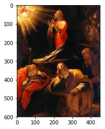
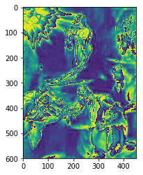
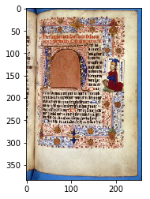
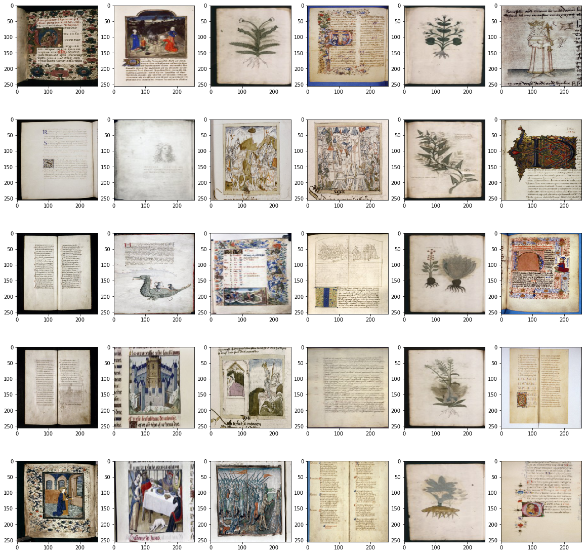
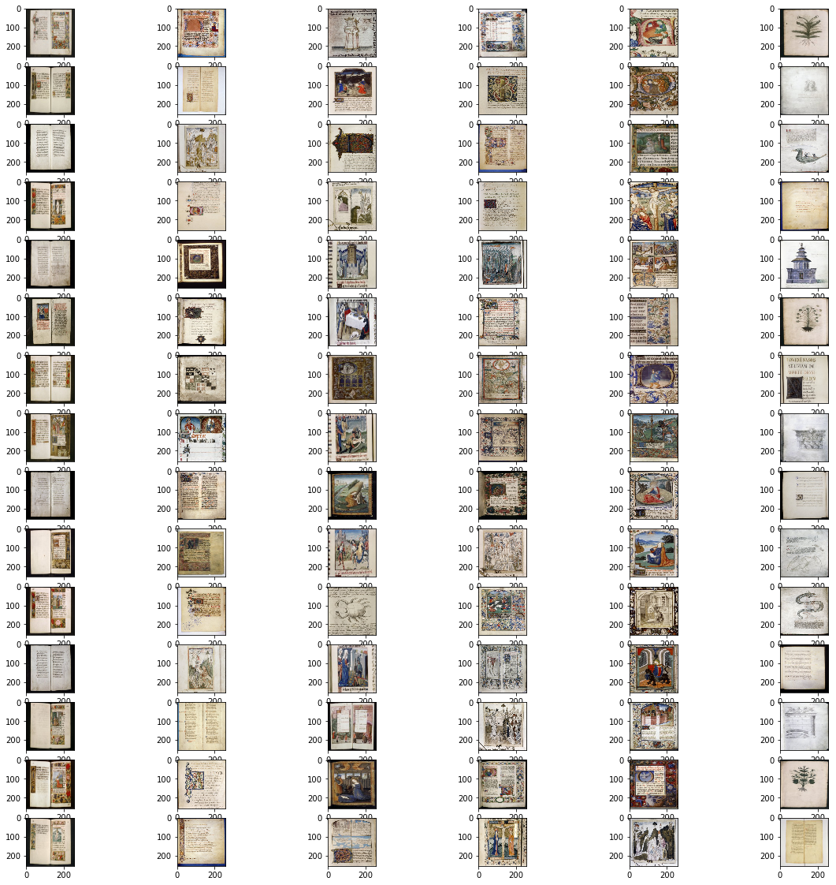
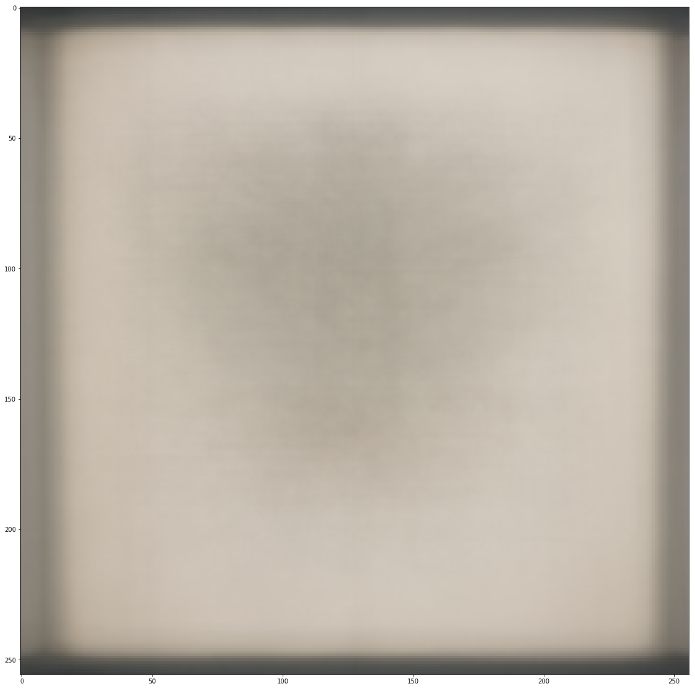
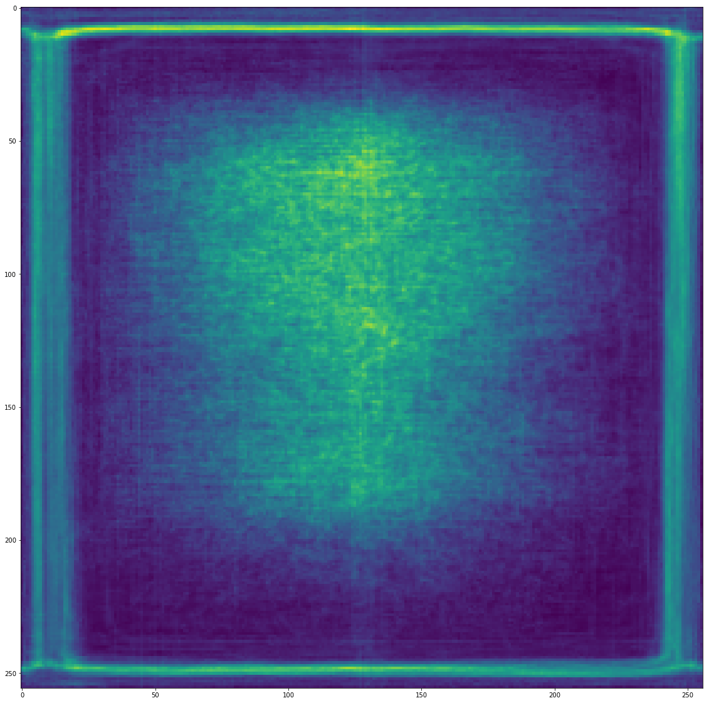
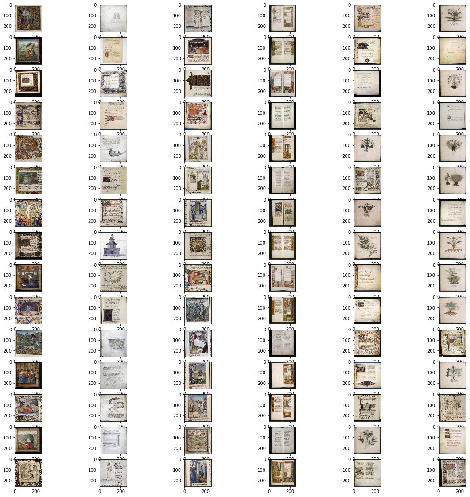

# A Title


<div markdown="1" class="cell code_cell">
<div class="input_area" markdown="1">
```python
import numpy as np
from matplotlib import pyplot as plt
%matplotlib inline
import glob
import tqdm
from skimage import io, transform

```
</div>

</div>


<div markdown="1" class="cell code_cell">
<div class="input_area" markdown="1">
```python
testim = io.imread('http://www.arte.it/foto/600x450/02/2670-car_09_672-458_resize.jpg')
plt.imshow(testim)

```
</div>

<div class="output_wrapper" markdown="1">
<div class="output_subarea" markdown="1">


{:.output_data_text}
```
<matplotlib.image.AxesImage at 0x1c17761160>
```


</div>
</div>
<div class="output_wrapper" markdown="1">
<div class="output_subarea" markdown="1">

{:.output_png}


</div>
</div>
</div>


### Some other content

Here is the plaintext...


<div markdown="1" class="cell code_cell">
<div class="input_area" markdown="1">
```python
plt.imshow(testim[:,:,0]*3)

```
</div>

<div class="output_wrapper" markdown="1">
<div class="output_subarea" markdown="1">


{:.output_data_text}
```
<matplotlib.image.AxesImage at 0x1c17875940>
```


</div>
</div>
<div class="output_wrapper" markdown="1">
<div class="output_subarea" markdown="1">

{:.output_png}


</div>
</div>
</div>


<div markdown="1" class="cell code_cell">
<div class="input_area" markdown="1">
```python
import cv2

```
</div>

</div>


<div markdown="1" class="cell code_cell">
<div class="input_area" markdown="1">
```python
import numpy as np

```
</div>

</div>


<div markdown="1" class="cell code_cell">
<div class="input_area" markdown="1">
```python
from matplotlib import pyplot as plt

```
</div>

</div>


<div markdown="1" class="cell code_cell">
<div class="input_area" markdown="1">
```python
%matplotlib inline

```
</div>

</div>


<div markdown="1" class="cell code_cell">
<div class="input_area" markdown="1">
```python
import glob

```
</div>

</div>


<div markdown="1" class="cell code_cell">
<div class="input_area" markdown="1">
```python
import tqdm

```
</div>

</div>


<div markdown="1" class="cell code_cell">
<div class="input_area" markdown="1">
```python
filenames = list(glob.glob('./15thc_LUNA Bodleian/*.jpg'))


```
</div>

</div>


<div markdown="1" class="cell code_cell">
<div class="input_area" markdown="1">
```python
print(len(filenames))

```
</div>

<div class="output_wrapper" markdown="1">
<div class="output_subarea" markdown="1">
{:.output_stream}
```
1612
```
</div>
</div>
</div>


<div markdown="1" class="cell code_cell">
<div class="input_area" markdown="1">
```python
books = []
i = 0

```
</div>

</div>


<div markdown="1" class="cell code_cell">
<div class="input_area" markdown="1">
```python
for fn in tqdm.tqdm_notebook(filenames):
    img = cv2.imread(fn)
    img = img[:,:,[2,1,0]]
    img = np.expand_dims(img,axis=0)
    books.extend(img)

```
</div>

<div class="output_wrapper" markdown="1">
<div class="output_subarea" markdown="1">

</div>
</div>
<div class="output_wrapper" markdown="1">
<div class="output_subarea" markdown="1">
{:.output_stream}
```

```
</div>
</div>
</div>


<div markdown="1" class="cell code_cell">
<div class="input_area" markdown="1">
```python
plt.imshow(books[5])

```
</div>

<div class="output_wrapper" markdown="1">
<div class="output_subarea" markdown="1">


{:.output_data_text}
```
<matplotlib.image.AxesImage at 0x7fa4ccac6590>
```


</div>
</div>
<div class="output_wrapper" markdown="1">
<div class="output_subarea" markdown="1">

{:.output_png}


</div>
</div>
</div>


<div markdown="1" class="cell code_cell">
<div class="input_area" markdown="1">
```python
import skimage
from skimage import color
from skimage import feature

```
</div>

</div>


<div markdown="1" class="cell code_cell">
<div class="input_area" markdown="1">
```python
def hogvec(img):
    img = np.resize(img,(128,128));
    imbw = color.rgb2gray(img);
    (hogvec, hogimg) = feature.hog(imbw, visualise=True);
    return hogvec

```
</div>

</div>


<div markdown="1" class="cell code_cell">
<div class="input_area" markdown="1">
```python
hogs = []
for b in tqdm.tqdm_notebook(books):
    hogs.append(np.expand_dims(hogvec(b),axis=0))

```
</div>

<div class="output_wrapper" markdown="1">
<div class="output_subarea" markdown="1">

</div>
</div>
<div class="output_wrapper" markdown="1">
<div class="output_subarea" markdown="1">
{:.output_stream}
```

```
</div>
</div>
</div>


<div markdown="1" class="cell code_cell">
<div class="input_area" markdown="1">
```python
from sklearn.neighbors import NearestNeighbors

```
</div>

</div>


<div markdown="1" class="cell code_cell">
<div class="input_area" markdown="1">
```python
hogsA = np.asarray(hogs)

```
</div>

</div>


<div markdown="1" class="cell code_cell">
<div class="input_area" markdown="1">
```python
hogsA = np.squeeze(hogsA)

```
</div>

</div>


<div markdown="1" class="cell code_cell">
<div class="input_area" markdown="1">
```python
hogsA.shape

```
</div>

<div class="output_wrapper" markdown="1">
<div class="output_subarea" markdown="1">


{:.output_data_text}
```
(1612, 15876)
```


</div>
</div>
</div>


<div markdown="1" class="cell code_cell">
<div class="input_area" markdown="1">
```python
from sklearn.cluster import KMeans

```
</div>

</div>


<div markdown="1" class="cell code_cell">
<div class="input_area" markdown="1">
```python
from sklearn.decomposition import PCA

```
</div>

</div>


<div markdown="1" class="cell code_cell">
<div class="input_area" markdown="1">
```python
pca = PCA(n_components=500)
hogsR = pca.fit_transform(hogsA)

```
</div>

</div>


<div markdown="1" class="cell code_cell">
<div class="input_area" markdown="1">
```python


numClusters = 6


kmeans = KMeans(n_clusters=numClusters, random_state=0,max_iter=300).fit(hogsR)

predictions = kmeans.predict(hogsR)

```
</div>

</div>


<div markdown="1" class="cell code_cell">
<div class="input_area" markdown="1">
```python


numVis = 5

imsize = (256,256)

plt.figure(figsize=(20,20))

for viscluster in range(numClusters):

    subindex = (predictions==viscluster)
    subbooks = []
    for i in range(len(books)):
        if(subindex[i] == True):
            subbooks.append(books[i])

    
    for i in range( np.min( [np.sum(predictions==viscluster),numVis])  ):
        plt.subplot(numVis,numClusters,    (i*numClusters) + 1 + viscluster)
        plt.imshow( cv2.resize(subbooks[i],imsize))

    

```
</div>

<div class="output_wrapper" markdown="1">
<div class="output_subarea" markdown="1">

{:.output_png}


</div>
</div>
</div>


<div markdown="1" class="cell code_cell">
<div class="input_area" markdown="1">
```python
def edgy(inimg):
    inimg = cv2.resize(inimg,(128,128))
    cannyimg = cv2.Canny(inimg,150,300);
    return cannyimg

```
</div>

</div>


<div markdown="1" class="cell code_cell">
<div class="input_area" markdown="1">
```python
edgeV = np.zeros((len(books),16384))
i = 0

for b in tqdm.tqdm_notebook(books):
    ci = edgy(b)
    cf = ci.flatten()
    edgeV[i,:] = cf
    i = i + 1

```
</div>

<div class="output_wrapper" markdown="1">
<div class="output_subarea" markdown="1">

</div>
</div>
<div class="output_wrapper" markdown="1">
<div class="output_subarea" markdown="1">
{:.output_stream}
```

```
</div>
</div>
</div>


<div markdown="1" class="cell code_cell">
<div class="input_area" markdown="1">
```python
edgy(b).shape

```
</div>

<div class="output_wrapper" markdown="1">
<div class="output_subarea" markdown="1">


{:.output_data_text}
```
(128, 128)
```


</div>
</div>
</div>


<div markdown="1" class="cell code_cell">
<div class="input_area" markdown="1">
```python
pca = PCA(n_components=50)
edgeR = pca.fit_transform(edgeV)

```
</div>

</div>


<div markdown="1" class="cell code_cell">
<div class="input_area" markdown="1">
```python

numClusters = 6

kmeans = KMeans(n_clusters=numClusters, random_state=0,max_iter=300).fit(edgeR)

predictions = kmeans.predict(edgeR)

```
</div>

</div>


<div markdown="1" class="cell code_cell">
<div class="input_area" markdown="1">
```python
predictions

```
</div>

<div class="output_wrapper" markdown="1">
<div class="output_subarea" markdown="1">


{:.output_data_text}
```
array([5, 2, 2, ..., 3, 2, 4], dtype=int32)
```


</div>
</div>
</div>


<div markdown="1" class="cell code_cell">
<div class="input_area" markdown="1">
```python
numVis = 15

imsize = (256,256)

plt.figure(figsize=(20,20))

for viscluster in range(numClusters):

    subindex = (predictions==viscluster)
    subbooks = []
    for i in range(len(books)):
        if(subindex[i] == True):
            subbooks.append(books[i])

    
    for i in range( np.min( [np.sum(predictions==viscluster),numVis])  ):
        plt.subplot(numVis,numClusters,    (i*numClusters) + 1 + viscluster)
        plt.imshow( cv2.resize(subbooks[i],imsize))

    

```
</div>

<div class="output_wrapper" markdown="1">
<div class="output_subarea" markdown="1">

{:.output_png}


</div>
</div>
</div>


<div markdown="1" class="cell code_cell">
<div class="input_area" markdown="1">
```python
ai = np.zeros((256,256,3,len(books)))
i = 0
for b in books:
    ai[:,:,:,i] = cv2.resize(b,(256,256))
    i = i + 1
    
    
ei = np.zeros((256,256,len(books)))
i = 0
for b in books:
    ei[:,:,i] = cv2.resize(cv2.Canny(b,150,300)  ,(256,256))
    i = i + 1    

```
</div>

</div>


<div markdown="1" class="cell code_cell">
<div class="input_area" markdown="1">
```python


vispred = 5

```
</div>

</div>


<div markdown="1" class="cell code_cell">
<div class="input_area" markdown="1">
```python
meanimg = np.mean(ai[:,:,:,predictions==vispred],axis=3)


plt.figure(figsize=(20,20))
plt.imshow(meanimg/256)

```
</div>

<div class="output_wrapper" markdown="1">
<div class="output_subarea" markdown="1">


{:.output_data_text}
```
<matplotlib.image.AxesImage at 0x7fa406ca6750>
```


</div>
</div>
<div class="output_wrapper" markdown="1">
<div class="output_subarea" markdown="1">

{:.output_png}


</div>
</div>
</div>


<div markdown="1" class="cell code_cell">
<div class="input_area" markdown="1">
```python
meanimg = np.mean(ei[:,:,predictions==vispred],axis=2)


plt.figure(figsize=(20,20))
plt.imshow(meanimg)

```
</div>

<div class="output_wrapper" markdown="1">
<div class="output_subarea" markdown="1">


{:.output_data_text}
```
<matplotlib.image.AxesImage at 0x7fa4068c0790>
```


</div>
</div>
<div class="output_wrapper" markdown="1">
<div class="output_subarea" markdown="1">

{:.output_png}


</div>
</div>
</div>


<div markdown="1" class="cell code_cell">
<div class="input_area" markdown="1">
```python
colV = np.zeros((len(books),49152))
i = 0

for b in tqdm.tqdm_notebook(books):
    ci = cv2.resize(b,(128,128))
    cf = ci.flatten()
    colV[i,:] = cf
    i = i + 1

```
</div>

<div class="output_wrapper" markdown="1">
<div class="output_subarea" markdown="1">

</div>
</div>
<div class="output_wrapper" markdown="1">
<div class="output_subarea" markdown="1">
{:.output_stream}
```

```
</div>
</div>
</div>


<div markdown="1" class="cell code_cell">
<div class="input_area" markdown="1">
```python
pca = PCA(n_components=50)
colR = pca.fit_transform(colV)

```
</div>

</div>


<div markdown="1" class="cell code_cell">
<div class="input_area" markdown="1">
```python

numClusters = 6

kmeans = KMeans(n_clusters=numClusters, random_state=0,max_iter=300).fit(colR)

predictions = kmeans.predict(colR)


```
</div>

</div>


<div markdown="1" class="cell code_cell">
<div class="input_area" markdown="1">
```python
numVis = 15

imsize = (256,256)

plt.figure(figsize=(20,20))

for viscluster in range(numClusters):

    subindex = (predictions==viscluster)
    subbooks = []
    for i in range(len(books)):
        if(subindex[i] == True):
            subbooks.append(books[i])

    
    for i in range( np.min( [np.sum(predictions==viscluster),numVis])  ):
        plt.subplot(numVis,numClusters,    (i*numClusters) + 1 + viscluster)
        plt.imshow( cv2.resize(subbooks[i],imsize))

    

```
</div>

<div class="output_wrapper" markdown="1">
<div class="output_subarea" markdown="1">

{:.output_png}


</div>
</div>
</div>


<div markdown="1" class="cell code_cell">
<div class="input_area" markdown="1">
```python


vispred = 4

meanimg = np.mean(ai[:,:,:,predictions==vispred],axis=3)


plt.figure(figsize=(20,20))
plt.imshow(meanimg/256)

```
</div>

<div class="output_wrapper" markdown="1">
<div class="output_subarea" markdown="1">


{:.output_data_text}
```
<matplotlib.image.AxesImage at 0x7fa408372a50>
```


</div>
</div>
<div class="output_wrapper" markdown="1">
<div class="output_subarea" markdown="1">

{:.output_png}


</div>
</div>
</div>

