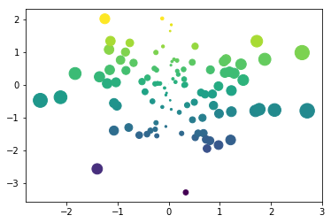
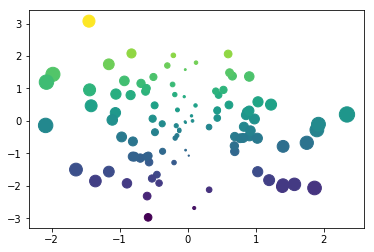

# Hiding or removing code blocks or entire cells

It's possible to control which cells show up in your final book pages. For example,
you may want to display a complex visualization to illustrate an idea, but don't
want the page to be cluttered with a large code cell that generated the viz. In other
cases, you may want to remove a code cell entirely.

In this case, you have two options:

* **Hiding** the inputs of a code cell will hide the cell's contents and provide
  a button that lets readers reveal the content.
* **Removing** the inputs (or the entire cell) will prevent the contents from
  making it into your book's HTML. It will be entirely gone (though still present in
  the `.ipynb` file)
  
In both cases, Jupyter Books uses **notebook cell tags** to determine which code cells to hide.
To make this process easier to manage, we recommend the
[JupyterLab Cell Tags extension](https://github.com/jupyterlab/jupyterlab-celltags)


## Hiding inputs and displaying a button to show them

If you add the tag `hide_input` to a cell, then Jupyter Book will hide the cell but
display the outputs.

Here's an example of cell metadata that would trigger the "hide code" behavior:

```json
{
    "tags": [
        "hide_input",
    ]
}
```

Jupyter Book will display a small button to the right of the 
location that used to hold the hidden contents. If a user clicks the button,
the contents will be displayed. For example, see the cell below contains the `hide_input`
tag:


<div markdown="1" class="cell code_cell">
<div class="input_area hidecode" markdown="1">
```python
import numpy as np
import matplotlib.pyplot as plt
plt.ion()

data = np.random.randn(2, 100)
fig, ax = plt.subplots()
ax.scatter(*data, c=data[1], s=100*np.abs(data[0]));

```
</div>

<div class="output_wrapper" markdown="1">
<div class="output_subarea" markdown="1">

{:.output_png}


</div>
</div>
</div>


Note how we only see the output by default. Now try clicking the button
to the right of the empty spot above!

Note that this button only shows up for cells where you've hidden the code:


<div markdown="1" class="cell code_cell">
<div class="input_area" markdown="1">
```python
# However, this code cell does not have the tag, and will show up!
print("This cell will show up!")

```
</div>

<div class="output_wrapper" markdown="1">
<div class="output_subarea" markdown="1">
{:.output_stream}
```
This cell will show up!
```
</div>
</div>
</div>


## Removing inputs from the HTML

In the above examples, we are only *hiding* the inputs, with the option
that readers can reveal them if they wish. However, if you'd like to completely **remove**
the inputs, so that their contents do not make it into the book's HTML, you may
use the following tag:

To remove the inputs of a cell:

```json
{
    "tags": [
        "remove_input",
    ]
}
```


The following cell demonstrates removing inputs. Note that in
this case, there is no button available to show the input contents,
the entire input cell is gone!


**Removing inputs**

The following cell has its inputs removed


<div markdown="1" class="cell code_cell">


<div class="output_wrapper" markdown="1">
<div class="output_subarea" markdown="1">

{:.output_png}


</div>
</div>
</div>


## Removing an entire cell

You can also remove **both** the inputs and outputs of a cell, in which case it
won't show up in your book at all. These cells remain in the notebook file itself,
so they'll show up if readers click on a JupyterHub or Binder link from a page.

To remove both the inputs and outputs of a cell, add the tag `remove_cell` to the tags
of the cell. Here's an example of cell metadata that would trigger the "remove cell" behavior:

```json
{
    "tags": [
        "remove_cell",
    ]
}
```

These cells will be entirely removed from each book page - remember that if you'd like to
optionally display the inputs of a cell instead, you should use the `hide_input` tag.

For example, there's a cell below this one that won't make it into the final book,
because it has been removed!


## Removing markdown cells

Sometimes, you have extra Markdown in your documents that isn't meant for the
reader. For example, if you want to organize your notebook based on developer-relevant
information (like "# Import packages") but you don't want the reader to see this.

In this case, you can use the `remove_cell` pattern described above as well.

Here's an example of markdown cell metadata that would trigger the "hide text" behavior:

```json
{
    "tags": [
        "remove_cell",
    ]
}
```


